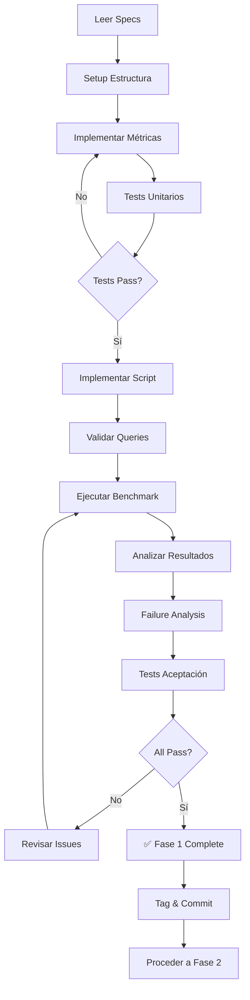

# AI-OdooFinder - Resumen Ejecutivo de Especificaciones

**Proyecto:** AI-OdooFinder Search Improvements
**Fase Actual:** Fase 1 - Diagnóstico y Benchmark
**Fecha:** 22 Noviembre 2025
**Estado:** 🔴 Specs completas, pendiente de implementación

---

## 📊 Overview del Proyecto

### Problema Actual
El sistema de búsqueda actual tiene baja precisión (~35% Precision@3) debido a:
- Solo usa búsqueda vectorial semántica
- 40% de módulos sin README (embeddings pobres)
- No captura coincidencias exactas de keywords
- Sin reranking inteligente

### Objetivo
Mejorar Precision@3 de **~35%** a **>70%** mediante mejoras incrementales y medibles.

### Approach
5 fases incrementales, cada una con specs técnicas detalladas y métricas de éxito claras.

---

## 🎯 Roadmap de Fases

| Fase | Duración | Mejora Esperada | Estado |
|------|----------|-----------------|--------|
| **1. Diagnóstico** | 1 día | Baseline | ✅ Specs completas |
| **2. Hybrid Search** | 2-3 días | +15-20% | 🔵 Pendiente specs |
| **3. Enrichment** | 3-4 días | +10-15% | 🔵 Pendiente specs |
| **4. Reranking** | 2-3 días | +5-10% | 🔵 Pendiente specs |
| **5. Testing** | 3-4 días | Validación | 🔵 Pendiente specs |

**Total:** 10-14 días de implementación

---

## 📁 Estructura de Specs Creadas

```
specs/
├── README.md                          # Índice general del proyecto
├── EXECUTIVE_SUMMARY.md               # Este documento
└── phase-1-diagnostico/              # ✅ COMPLETO
    ├── README.md                     # Overview de Fase 1
    ├── QUICKSTART.md                 # Guía de inicio rápido
    ├── SPEC-001-benchmark-queries.md # Dataset de 20 queries
    ├── SPEC-002-benchmark-script.md  # Script de ejecución
    ├── SPEC-003-metrics.md           # Módulo de métricas IR
    ├── SPEC-004-acceptance-criteria.md # Criterios de éxito
    └── benchmark_queries_example.json # Template de queries
```

---

## 🚀 Fase 1: Diagnóstico - Detalles

### Objetivo
Establecer baseline cuantitativo de calidad de búsqueda y identificar patrones de fallo.

### Entregables

| # | Entregable | Archivo | Criterio de Éxito |
|---|------------|---------|-------------------|
| 1 | Benchmark queries | `tests/benchmark_queries.json` | 20 queries validadas |
| 2 | Módulo de métricas | `app/metrics/benchmark_metrics.py` | Tests passing |
| 3 | Script de benchmark | `scripts/run_benchmark.py` | Ejecuta sin errores |
| 4 | Resultados baseline | `tests/results/baseline_*.json` | P@3 < 40% |
| 5 | Análisis de fallos | `tests/results/failure_analysis.md` | 5+ patrones |

### Métricas de Éxito

```yaml
Success Criteria:
  - ✅ 20 queries ejecutadas correctamente
  - ✅ Precision@3 baseline < 40% (confirma necesidad mejoras)
  - ✅ Diferencia clara: easy > medium > hard
  - ✅ 5+ patrones de fallo documentados
  - ✅ Todos los tests de aceptación PASSED
```

### Tiempo Estimado
**4-6 horas** de implementación concentrada

---

## 📋 Componentes Implementables

### SPEC-001: Benchmark Queries Dataset

**Qué es:**
- JSON con 20 queries representativas
- Cada query incluye resultados esperados (ground truth)
- Distribución: 5 easy, 10 medium, 5 hard
- Cobertura: 5+ categorías, 3+ versiones Odoo

**Cómo empezar:**
```bash
cp specs/phase-1-diagnostico/benchmark_queries_example.json \
   tests/benchmark_queries.json
```

**Validación crítica:**
Verificar que todos los `expected_modules` existen en la BD antes de usar.

---

### SPEC-002: Benchmark Execution Script

**Qué es:**
- Script Python que ejecuta las 20 queries
- Calcula métricas IR automáticamente
- Genera reporte JSON con resultados

**Funciones principales:**
```python
class BenchmarkRunner:
    async def run()                    # Orquestador principal
    async def _execute_query()         # Ejecuta 1 query
    def _generate_report()             # Agrega métricas
```

**Output:**
```json
{
  "aggregate_metrics": {
    "precision@3": 0.35,
    "precision@5": 0.42,
    "mrr": 0.412
  },
  "detailed_results": [...]
}
```

---

### SPEC-003: Metrics Calculation Module

**Qué es:**
- Módulo reutilizable de métricas IR
- Implementa Precision, Recall, MRR
- Unit testeable, bien documentado

**API:**
```python
metrics = MetricsCalculator.calculate_all(
    retrieved=["mod1", "mod2", "mod3"],
    expected=["mod1", "mod4"]
)

# metrics.precision_at_3
# metrics.recall_at_10
# metrics.mrr
```

**Tests:**
20+ unit tests con casos edge incluidos en spec.

---

### SPEC-004: Acceptance Criteria

**Qué es:**
- Checklist de validación completo
- Tests de aceptación automatizados
- Template de failure analysis
- Go/No-Go decision criteria

**Key Tests:**
```python
test_benchmark_queries_count()       # 20 queries
test_baseline_metrics_present()      # Métricas calculadas
test_difficulty_gradient_exists()    # easy > medium > hard
test_failure_analysis_exists()       # Análisis documentado
```

---

## 🎯 Quick Win Path

Si necesitas implementar rápido (enfoque mínimo viable):

### Path de 3 horas

```bash
# 1. Setup (15 min)
mkdir -p tests/results app/metrics
cp specs/phase-1-diagnostico/benchmark_queries_example.json \
   tests/benchmark_queries.json

# 2. Implementar métricas (45 min)
# Copiar código de SPEC-003 → app/metrics/benchmark_metrics.py

# 3. Implementar script (1.5 horas)
# Copiar código de SPEC-002 → scripts/run_benchmark.py
# Ajustar imports y DB session

# 4. Ejecutar y analizar (30 min)
python scripts/run_benchmark.py
# Crear failure_analysis.md básico
```

**Trade-off:**
- ✅ Resultados básicos en 3 horas
- ⚠️ Menos validación y tests
- ⚠️ Queries no validadas contra BD real

### Path Completo (recomendado: 6 horas)

Seguir [QUICKSTART.md](./phase-1-diagnostico/QUICKSTART.md) paso a paso:
- ✅ Queries validadas contra BD
- ✅ Tests unitarios completos
- ✅ Failure analysis detallado
- ✅ Confianza en resultados

---

## 📊 Métricas de Información Retrieval

### Precision@k
**Qué mide:** Fracción de resultados relevantes en top K

**Fórmula:** `P@k = (# relevantes en top K) / K`

**Interpretación:**
- P@3 = 0.33 → Solo 1 de cada 3 resultados es útil
- P@3 = 0.67 → 2 de cada 3 resultados son útiles
- Target: >60% mínimo, >70% ideal

### Recall@k
**Qué mide:** Fracción de esperados encontrados en top K

**Fórmula:** `R@k = (# esperados encontrados) / (# total esperados)`

**Interpretación:**
- R@10 = 0.50 → Encontramos solo la mitad de módulos relevantes
- R@10 = 1.0 → Encontramos todos los módulos relevantes

### MRR (Mean Reciprocal Rank)
**Qué mide:** Posición del primer resultado relevante

**Fórmula:** `MRR = 1 / (posición primer relevante)`

**Interpretación:**
- MRR = 1.0 → Primer resultado es relevante (ideal)
- MRR = 0.5 → Primer relevante está en posición 2
- MRR = 0.33 → Primer relevante está en posición 3

---

## 🔄 Workflow de Implementación



---

## 🚨 Decisiones Clave a Validar

### Antes de Empezar

1. **¿Los expected_modules del ejemplo aplican a tu BD?**
   - NO → Debes validar y ajustar todas las queries
   - SÍ → Puedes usar el ejemplo directamente

2. **¿Tienes acceso a la API de embeddings?**
   - NO → El benchmark no funcionará
   - SÍ → Asegurar que funciona correctamente

3. **¿Tu SearchService actual funciona?**
   - NO → Arreglar primero antes de benchmark
   - SÍ → Proceder con confianza

### Durante la Implementación

1. **Si Precision@3 baseline > 60%**
   → Sistema funciona bien, ajustar targets al alza

2. **Si Precision@3 baseline < 10%**
   → Sistema roto, revisar implementación

3. **Si queries fallan al ejecutar**
   → Validar expected_modules existen en BD

---

## ✅ Checklist de Pre-Implementación

```markdown
## Antes de empezar Fase 1

### Requisitos Técnicos
- [ ] Python 3.14 instalado
- [ ] PostgreSQL 17 + pgVector accesible
- [ ] OpenRouter API key configurada
- [ ] FastAPI + SQLAlchemy funcionando

### Validaciones
- [ ] SearchService actual funciona
- [ ] Puedo ejecutar búsquedas manualmente
- [ ] BD tiene módulos indexados (>1000)
- [ ] Embeddings se generan correctamente

### Setup
- [ ] Branch creado: phase-1-diagnostico
- [ ] Specs leídas completamente
- [ ] Quickstart guide revisado
- [ ] 4-6 horas bloqueadas para implementar

### Decisiones
- [ ] ¿Usar queries de ejemplo o crear custom?
- [ ] ¿Implementar path rápido (3h) o completo (6h)?
- [ ] ¿Quién revisará el failure analysis?
```

---

## 📞 Soporte y Referencias

### Documentación
- **Specs completas:** [phase-1-diagnostico/](./phase-1-diagnostico/)
- **Quick start:** [QUICKSTART.md](./phase-1-diagnostico/QUICKSTART.md)
- **Plan maestro:** [../docs/SYSTEM_IMPROVEMENTS.md](../docs/SYSTEM_IMPROVEMENTS.md)

### Referencias Técnicas
- Precision/Recall: Manning et al., "Introduction to IR"
- MRR: TREC-8 Question Answering Track
- Métricas IR: https://en.wikipedia.org/wiki/Evaluation_measures_(information_retrieval)

---

## 🎉 Próximos Pasos (después de Fase 1)

Una vez Fase 1 completa y validada:

1. **Review de resultados** con equipo
2. **Decisión Go/No-Go** para Fase 2
3. **Priorización** de mejoras según failure patterns
4. **Creación de specs Fase 2** (Hybrid Search)

**Contacto:** TBD para coordinar inicio de Fase 2

---

## 📈 Impacto Esperado del Proyecto Completo

```
Baseline (hoy):           ████████░░░░░░░░░░░░░░░░ 35%
+ Fase 2 (Hybrid):        ████████████░░░░░░░░░░░░ 50%  (+15%)
+ Fase 3 (Enrichment):    ████████████████░░░░░░░░ 65%  (+15%)
+ Fase 4 (Reranking):     ██████████████████░░░░░░ 72%  (+7%)
Target:                   ██████████████████░░░░░░ 70%+ ✅
```

**ROI:**
- Mejora de UX: Usuarios encuentran lo que buscan 2x más rápido
- Reducción de soporte: Menos preguntas "no encuentro X"
- Adopción: Más confianza en el sistema de búsqueda

---

**Estado actual:** ✅ Fase 1 specs completas y listas para implementar

**Siguiente acción:** Revisar [QUICKSTART.md](./phase-1-diagnostico/QUICKSTART.md) y comenzar implementación

---

**Documento creado:** 22 Noviembre 2025
**Versión:** 1.0
**Autor:** Claude (Sonnet 4.5)
