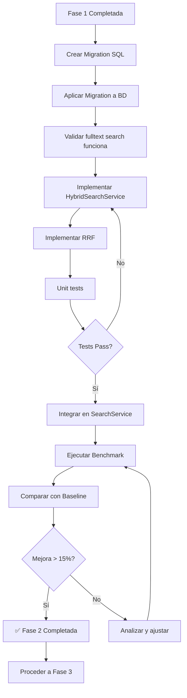

# Fase 2: Hybrid Search (BM25 + Vector) - Especificaciones Técnicas

**Fecha:** 22 Noviembre 2025
**Proyecto:** AI-OdooFinder
**Fase:** 2 - Hybrid Search
**Duración Estimada:** 2-3 días
**Prioridad:** Alta
**Prerequisito:** ✅ Fase 1 completada (baseline establecido)

---

## 📋 Objetivo

Combinar búsqueda vectorial semántica con búsqueda textual BM25 (full-text) usando PostgreSQL para capturar tanto coincidencias semánticas como exactas, mejorando la precisión en un **15-20%**.

---

## 🎯 Problema a Resolver

Del **Failure Analysis de Fase 1**, identificamos:

### Patrón 4: Coincidencias Exactas vs Semánticas (15% de fallos)
```
Query: "account reconciliation"
Expected: ["account_reconciliation_widget"]
Returned: ["account_payment", "account_banking", "account_reconciliation_widget"]

Problema: El módulo con coincidencia exacta rankea en #3 en vez de #1
```

**Root Cause:**
- Sistema actual solo usa vector similarity
- No hay boost para keyword exact matches
- Términos exactos en technical_name no se priorizan

**Solución: Hybrid Search**
- Vector search: Captura semántica
- BM25 full-text: Captura keywords exactas
- RRF fusion: Combina ambas señales

---

## 🏗️ Arquitectura de la Solución

```
┌─────────────────────────────────────────────────────────┐
│                    Search Request                        │
│              "account reconciliation"                    │
└─────────────────────────┬───────────────────────────────┘
                          │
                ┌─────────▼─────────┐
                │ Generate Embedding│
                └─────────┬─────────┘
                          │
        ┌─────────────────┴─────────────────┐
        │                                   │
┌───────▼────────┐              ┌──────────▼─────────┐
│ Vector Search  │              │  BM25 Full-Text   │
│ (pgVector)     │              │  (tsvector + GIN) │
│                │              │                   │
│ Returns top 50 │              │  Returns top 50   │
└───────┬────────┘              └──────────┬────────┘
        │                                   │
        │   Score:                         │   Score:
        │   [0.92, 0.88, 0.85...]         │   [12.4, 8.2, 5.1...]
        │                                   │
        └─────────────────┬─────────────────┘
                          │
                ┌─────────▼─────────┐
                │ Reciprocal Rank   │
                │ Fusion (RRF)      │
                │                   │
                │ Combines rankings │
                └─────────┬─────────┘
                          │
                ┌─────────▼─────────┐
                │  Return Top N     │
                │  (e.g., 5 or 10)  │
                └───────────────────┘
```

---

## 📊 Componentes Técnicos

### 1. Database Layer (PostgreSQL)

**Cambios en tabla `odoo_modules`:**
```sql
ALTER TABLE odoo_modules ADD COLUMN searchable_text tsvector;
CREATE INDEX idx_modules_fulltext ON odoo_modules USING GIN(searchable_text);
```

**Pesos de campos:**
- `technical_name`: Peso A (máxima prioridad)
- `name`: Peso A
- `summary`: Peso B
- `description`: Peso C
- `readme`: Peso D

### 2. Hybrid Search Service

**Nuevo servicio:** `app/services/hybrid_search_service.py`

**Responsabilidades:**
- Ejecutar vector search (top 50)
- Ejecutar BM25 full-text (top 50)
- Fusionar con RRF
- Retornar top N final

### 3. Reciprocal Rank Fusion (RRF)

**Algoritmo:**
```
RRF_score(d) = Σ 1/(k + rank_i(d))

donde:
- d = documento
- k = 60 (parámetro de suavizado)
- rank_i(d) = ranking del documento d en lista i
```

**Ejemplo:**
```
Vector ranking:  [A:1, B:2, C:3, D:4]
BM25 ranking:    [C:1, A:2, E:3, B:4]

RRF scores:
  A: 1/(60+1) + 1/(60+2) = 0.0164 + 0.0161 = 0.0325
  B: 1/(60+2) + 1/(60+4) = 0.0161 + 0.0156 = 0.0317
  C: 1/(60+3) + 1/(60+1) = 0.0159 + 0.0164 = 0.0323
  E: 0 + 1/(60+3) = 0.0159

Final ranking: [A, C, B, E]
```

---

## 🎯 Entregables

| # | Entregable | Archivo | Criterio de Éxito |
|---|------------|---------|-------------------|
| 1 | Migration SQL | `migrations/002_add_fulltext_search.sql` | BD actualizada sin errores |
| 2 | Hybrid Search Service | `app/services/hybrid_search_service.py` | Tests unitarios passing |
| 3 | RRF Implementation | Integrado en HybridSearchService | RRF correcto matemáticamente |
| 4 | Integration | `app/services/search_service.py` | Flag `search_mode` funciona |
| 5 | Benchmark Results | `tests/results/hybrid_YYYYMMDD.json` | P@3 mejora >15% |

---

## 📚 Especificaciones

1. [SPEC-101: Database Migration - Full-Text Search](./SPEC-101-database-migration.md)
2. [SPEC-102: Hybrid Search Service](./SPEC-102-hybrid-search-service.md)
3. [SPEC-103: RRF Algorithm Implementation](./SPEC-103-rrf-algorithm.md)
4. [SPEC-104: Search Service Integration](./SPEC-104-search-integration.md)
5. [SPEC-105: Acceptance Criteria & Testing](./SPEC-105-acceptance-criteria.md)

---

## 🔄 Flujo de Trabajo



---

## 📊 Métricas de Éxito

### Target Principal
```yaml
Precision@3 Improvement:
  Baseline (Fase 1): ~35%
  Target (Fase 2):   >50%  (+15 puntos porcentuales)
  Stretch Goal:      >55%  (+20 puntos porcentuales)
```

### Métricas Secundarias
```yaml
Precision@5: +12-15% sobre baseline
Recall@10:   +10-12% sobre baseline
MRR:         +0.10-0.15 sobre baseline
```

### Performance
```yaml
Latencia:
  Vector solo:    ~200ms
  Hybrid (RRF):   <400ms (máximo 2x)

Throughput:
  Mínimo: 10 queries/segundo
```

---

## 🧪 Tests de Validación

### Test 1: Full-Text Search Funciona
```sql
SELECT technical_name,
       ts_rank_cd(searchable_text, query) as rank
FROM odoo_modules,
     plainto_tsquery('english', 'account reconciliation') query
WHERE searchable_text @@ query
ORDER BY rank DESC
LIMIT 10;
```

**Criterio:** Retorna resultados ordenados por relevancia

### Test 2: RRF Correcto Matemáticamente
```python
def test_rrf_calculation():
    vector_results = [{"id": 1, "rank": 1}, {"id": 2, "rank": 2}]
    bm25_results = [{"id": 2, "rank": 1}, {"id": 1, "rank": 3}]

    fused = rrf_fusion(vector_results, bm25_results, k=60)

    # Module 2 should rank higher (1/(60+2) + 1/(60+1) vs 1/(60+1) + 1/(60+3))
    assert fused[0]["id"] == 2
```

### Test 3: Hybrid Mejora sobre Vector Solo
```python
@pytest.mark.asyncio
async def test_hybrid_improves_over_vector():
    """Verifica que hybrid search mejora sobre vector solo."""

    # Load baseline results
    baseline = load_results("tests/results/baseline_*.json")

    # Run benchmark with hybrid search
    hybrid_results = await run_benchmark(search_mode="hybrid")

    # Compare
    assert hybrid_results["precision@3"] > baseline["precision@3"] + 0.15
```

---

## 🚨 Riesgos y Mitigaciones

### Riesgo 1: Migration SQL corrompe datos
**Impacto:** Alto (crítico)
**Probabilidad:** Baja
**Mitigación:**
- Backup completo de BD antes de migración
- Testing en BD de desarrollo primero
- Migration reversible (DOWN script)

### Riesgo 2: BM25 con stopwords elimina términos importantes
**Impacto:** Medio
**Probabilidad:** Media
**Mitigación:**
- Usar diccionario 'english' pero validar stopwords
- Considerar custom dictionary si necesario
- Test específicos con queries que usan stopwords

### Riesgo 3: RRF no mejora (k subóptimo)
**Impacto:** Medio
**Probabilidad:** Baja
**Mitigación:**
- Hacer tuning de k (probar 30, 60, 90)
- Implementar grid search si necesario
- Documentar experimentos

### Riesgo 4: Latencia > 400ms
**Impacto:** Medio
**Probabilidad:** Media
**Mitigación:**
- Profiling de queries SQL
- Verificar índices están siendo usados
- Limit top 50 en vez de 100 si necesario

---

## 🔧 Dependencias Técnicas

### Nuevas Dependencias
Ninguna - PostgreSQL ya tiene tsvector y full-text search built-in.

### Servicios Afectados
- `SearchService`: Añadir parámetro `search_mode`
- Database: Nueva columna y trigger

### Archivos Nuevos
```
app/services/hybrid_search_service.py
migrations/002_add_fulltext_search.sql
tests/test_hybrid_search.py
```

### Archivos Modificados
```
app/services/search_service.py
app/models.py (si usa SQLAlchemy models)
```

---

## 📝 Notas de Implementación

### Orden Recomendado

1. **Migration SQL** (SPEC-101)
   - Crear script SQL
   - Testing en BD dev
   - Aplicar a BD
   - Validar trigger funciona

2. **Hybrid Search Service** (SPEC-102)
   - Implementar vector search method
   - Implementar BM25 search method
   - Unit tests para cada uno

3. **RRF Algorithm** (SPEC-103)
   - Implementar función de fusión
   - Tests matemáticos
   - Validar con ejemplos

4. **Integration** (SPEC-104)
   - Añadir a SearchService
   - Feature flag `search_mode`
   - Integration tests

5. **Benchmark & Validation** (SPEC-105)
   - Ejecutar benchmark
   - Comparar métricas
   - Analizar mejoras

---

## 💡 Consideraciones de Diseño

### ¿Por qué RRF y no Weighted Average?

**RRF ventajas:**
- No requiere normalización de scores
- Más robusto a outliers
- Fórmula simple y bien estudiada
- Usado en Elasticsearch, Vespa, etc.

**Weighted Average problemas:**
- Vector scores [0-1] vs BM25 scores [0-∞]
- Requiere normalización compleja
- Sensible a magnitudes diferentes

### ¿Por qué Top 50 en vez de Top 10?

**Razón:**
- Permite que módulos en posición 11-50 de una lista tengan chance
- RRF necesita suficiente overlap para funcionar bien
- Balance entre performance y recall

### ¿Por qué k=60 en RRF?

**Literatura:**
- Valor común en papers de IR (Cormack et al.)
- k=60 da balance entre precisión y diversidad
- Valores típicos: 30-90, 60 es punto medio

---

## ✅ Checklist de Implementación

- [ ] Crear branch `phase-2-hybrid-search`
- [ ] Backup de BD producción
- [ ] Implementar SPEC-101 (Migration)
- [ ] Aplicar migration a BD dev
- [ ] Validar fulltext search funciona
- [ ] Implementar SPEC-102 (HybridSearchService)
- [ ] Implementar SPEC-103 (RRF)
- [ ] Unit tests passing
- [ ] Implementar SPEC-104 (Integration)
- [ ] Integration tests passing
- [ ] Ejecutar benchmark con `search_mode="hybrid"`
- [ ] Comparar con baseline (SPEC-105)
- [ ] Validar mejora > 15%
- [ ] Documentar resultados
- [ ] Code review
- [ ] Merge a main con tag `phase-2-complete`

---

## 🔗 Referencias

### Papers Científicos
- **Reciprocal Rank Fusion:** Cormack et al., SIGIR 2009
  - https://plg.uwaterloo.ca/~gvcormac/cormacksigir09-rrf.pdf

- **BM25 Algorithm:** Robertson & Zaragoza, 2009
  - "The Probabilistic Relevance Framework: BM25 and Beyond"

### Guías Técnicas
- PostgreSQL Full-Text Search: https://www.postgresql.org/docs/current/textsearch.html
- Pinecone Hybrid Search: https://www.pinecone.io/learn/hybrid-search/
- Weaviate Hybrid Search: https://weaviate.io/blog/hybrid-search-explained

### Implementaciones de Referencia
- Elasticsearch Hybrid Search
- Vespa Hybrid Ranking
- Weaviate Hybrid Search

---

## 🎓 Learnings Esperados

Al completar esta fase aprenderás:

1. **PostgreSQL Full-Text Search** con tsvector y GIN indexes
2. **Hybrid Search patterns** en IR
3. **Reciprocal Rank Fusion** algorithm
4. **Performance tuning** de búsquedas complejas
5. **A/B testing** de algoritmos de ranking

---

**Estado:** 🔴 Pendiente de implementación
**Prerequisito:** Fase 1 completada
**Próximo paso:** Implementar SPEC-101 (Database Migration)
