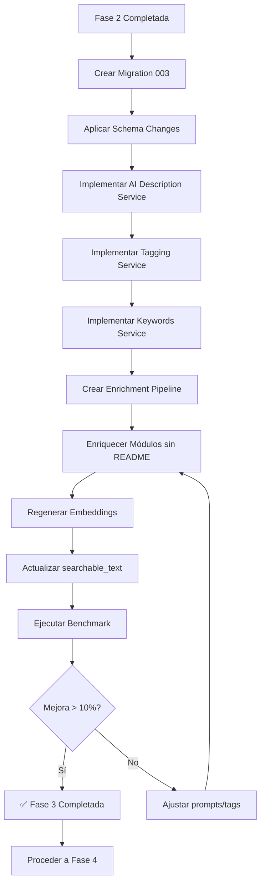

# Fase 3: Data Enrichment - Especificaciones Técnicas

**Fecha:** 22 Noviembre 2025
**Proyecto:** AI-OdooFinder
**Fase:** 3 - Data Enrichment
**Duración Estimada:** 3-4 días
**Prioridad:** Alta
**Prerequisito:** ✅ Fase 2 completada (Hybrid Search funcional)

---

## 📋 Objetivo

Enriquecer los datos de módulos con información adicional generada por IA para mejorar la calidad de las búsquedas, especialmente para módulos con poca documentación (sin README o con summaries pobres).

---

## 🎯 Problema a Resolver

Del **Failure Analysis de Fase 1 y 2**, identificamos:

### Patrón 3: Módulos Sin README (30% de fallos)
```
Query: "informes financieros personalizados"
Expected: ["mis_builder", "account_financial_report"]
Returned: ["account_report", "account_invoice_report", "base_report"]

Problema: mis_builder solo tiene summary: "Management Information System"
         → Embedding pobre, no captura "informes", "financieros", "personalizados"
```

### Patrón 2: Sinónimos y Terminología (25% de fallos)
```
Query: "separar flujos B2B y B2C"
Expected: ["sale_b2b_b2c", "portal_partner_type"]

Problema: Módulos no tienen tags "B2B", "B2C" en sus metadatos
         → Vector search no conecta la query con los módulos
```

**Solución: Data Enrichment**
1. **AI Descriptions**: Generar descripciones ricas con Claude para módulos sin README
2. **Functional Tags**: Añadir tags estructurados (categorías, casos de uso, keywords)
3. **Synonyms Mapping**: Mapear términos de negocio a technical_names
4. **Enhanced Embeddings**: Regenerar embeddings con datos enriquecidos

---

## 🏗️ Arquitectura de la Solución

```
┌─────────────────────────────────────────────────────┐
│           Enrichment Pipeline                       │
└─────────────────────────────────────────────────────┘
                          │
        ┌─────────────────┼─────────────────┐
        │                 │                 │
┌───────▼────────┐ ┌──────▼──────┐ ┌───────▼────────┐
│ AI Description │ │   Functional│ │    Keywords    │
│   Generator    │ │     Tags    │ │   Extraction   │
│                │ │             │ │                │
│ Claude Haiku   │ │  Rule-based │ │   TF-IDF +     │
│ + Context      │ │  + LLM      │ │   Extraction   │
└───────┬────────┘ └──────┬──────┘ └───────┬────────┘
        │                 │                 │
        └─────────────────┼─────────────────┘
                          │
                ┌─────────▼─────────┐
                │  Store Enriched   │
                │  Data in JSON     │
                │                   │
                │  ai_description   │
                │  functional_tags[]│
                │  keywords[]       │
                └─────────┬─────────┘
                          │
                ┌─────────▼─────────┐
                │ Regenerate        │
                │ Embeddings        │
                │                   │
                │ Include enriched  │
                │ data in context   │
                └─────────┬─────────┘
                          │
                ┌─────────▼─────────┐
                │ Update searchable │
                │ _text (full-text) │
                │                   │
                │ Include tags +    │
                │ keywords          │
                └───────────────────┘
```

---

## 📊 Componentes Técnicos

### 1. Schema Changes (PostgreSQL)

```sql
ALTER TABLE odoo_modules
ADD COLUMN ai_description TEXT,
ADD COLUMN functional_tags TEXT[],
ADD COLUMN keywords TEXT[],
ADD COLUMN enrichment_metadata JSONB;
```

### 2. AI Description Generator

**Servicio:** `app/services/ai_description_service.py`

**Prompt Template:**
```
Eres un experto en Odoo ERP. Genera una descripción técnica y útil
para este módulo basándote en su metadata:

Technical Name: {technical_name}
Name: {name}
Summary: {summary}
Dependencies: {depends}
Version: {version}

Genera una descripción de 2-3 párrafos que incluya:
1. Qué funcionalidad proporciona
2. Casos de uso típicos
3. Integraciones con otros módulos

Usa terminología que un usuario buscaría (no solo jerga técnica).
```

### 3. Functional Tags Taxonomy

```yaml
Categories:
  - sales_workflow
  - accounting_finance
  - inventory_logistics
  - manufacturing
  - hr_payroll
  - portal_website
  - localization
  - reporting
  - integration
  - automation

Use Cases:
  - b2b_commerce
  - b2c_ecommerce
  - multi_company
  - subscription_management
  - project_management
  - quality_control
  - document_management
  - compliance_legal

Technical Features:
  - api_integration
  - automation_workflow
  - custom_reports
  - email_notifications
  - mobile_app
  - multi_language
  - permissions_security
```

### 4. Keywords Extraction

**Fuentes:**
- **TF-IDF**: Desde description + README
- **Named Entities**: Con spaCy o similar
- **Synonyms**: Base de datos de sinónimos (B2B → partner_type)
- **Domain Terms**: Terminología específica de Odoo

---

## 🎯 Entregables

| # | Entregable | Archivo | Criterio de Éxito |
|---|------------|---------|-------------------|
| 1 | Schema migration | `migrations/003_add_enrichment_fields.sql` | BD actualizada |
| 2 | AI Description Service | `app/services/ai_description_service.py` | Genera descripciones válidas |
| 3 | Functional Tags | `app/services/tagging_service.py` | Tags asignados automáticamente |
| 4 | Keywords Extraction | `app/services/keyword_service.py` | Keywords relevantes extraídos |
| 5 | Enrichment Pipeline | `scripts/enrich_modules.py` | Procesa todos los módulos |
| 6 | Benchmark Results | `tests/results/enriched_YYYYMMDD.json` | P@3 mejora >10% |

---

## 📚 Especificaciones

1. [SPEC-201: Database Schema - Enrichment Fields](./SPEC-201-database-schema.md)
2. [SPEC-202: AI Description Generator](./SPEC-202-ai-description-generator.md)
3. [SPEC-203: Functional Tagging System](./SPEC-203-functional-tagging.md)
4. [SPEC-204: Keywords Extraction](./SPEC-204-keywords-extraction.md)
5. [SPEC-205: Enrichment Pipeline](./SPEC-205-enrichment-pipeline.md)
6. [SPEC-206: Acceptance Criteria](./SPEC-206-acceptance-criteria.md)

---

## 🔄 Flujo de Trabajo



---

## 📊 Métricas de Éxito

### Target Principal
```yaml
Precision@3 Improvement:
  Baseline (Fase 2): ~52%
  Target (Fase 3):   >62%  (+10 puntos porcentuales)
  Stretch Goal:      >67%  (+15 puntos porcentuales)
```

### Métricas de Cobertura
```yaml
AI Descriptions Generated:
  Target: >80% de módulos sin README

Functional Tags Assigned:
  Target: 100% de módulos tienen al menos 2 tags

Keywords Extracted:
  Target: Promedio 8-12 keywords por módulo
```

### Cost Control
```yaml
Claude API Costs:
  Estimated: ~$2-5 para 2,500 módulos
  Using: Claude Haiku (más económico)
  Budget max: $10
```

---

## 🧪 Tests de Validación

### Test 1: AI Description Quality

```python
def test_ai_description_quality():
    """Verifica que descripciones generadas son útiles."""

    module = {
        "technical_name": "sale_subscription",
        "summary": "Recurring invoices"
    }

    description = ai_service.generate_description(module)

    # Quality checks
    assert len(description) > 200  # Suficientemente detallada
    assert "subscription" in description.lower()
    assert "recurring" in description.lower()
    # Should mention use cases
    assert any(word in description.lower()
               for word in ["customer", "invoice", "automatic"])
```

### Test 2: Tags Relevance

```python
def test_functional_tags_assigned():
    """Verifica que tags son relevantes."""

    module = {
        "technical_name": "account_invoice_recurring",
        "summary": "Recurring invoices"
    }

    tags = tagging_service.assign_tags(module)

    assert "accounting_finance" in tags
    assert "subscription_management" in tags
    assert len(tags) >= 2
```

### Test 3: Keywords Extracted

```python
def test_keywords_extraction():
    """Verifica extracción de keywords."""

    module = {
        "description": "B2B portal for suppliers with quotations",
        "summary": "Supplier portal"
    }

    keywords = keyword_service.extract_keywords(module)

    assert "b2b" in keywords
    assert "supplier" in keywords
    assert "portal" in keywords
    assert len(keywords) >= 5
```

---

## 🚨 Riesgos y Mitigaciones

### Riesgo 1: Claude API Rate Limits
**Impacto:** Alto - Bloquearía enrichment
**Probabilidad:** Media
**Mitigación:**
- Batch requests (100 módulos a la vez)
- Retry con exponential backoff
- Cache de descripciones generadas
- Usar Haiku (tier más alto de rate limits)

### Riesgo 2: AI Descriptions de Baja Calidad
**Impacto:** Medio - No mejoraría búsquedas
**Probabilidad:** Media
**Mitigación:**
- Prompt engineering cuidadoso
- Human review de muestra (20 descripciones)
- Quality scoring automático
- Fallback a template-based descriptions

### Riesgo 3: Costo de API Excesivo
**Impacto:** Bajo
**Probabilidad:** Baja
**Mitigación:**
- Usar Claude Haiku (~$0.001 por request)
- Solo generar para módulos sin README (40%)
- Budget alert en $5

### Riesgo 4: Tags Incorrectos
**Impacto:** Medio
**Probabilidad:** Media
**Mitigación:**
- Rule-based + LLM hybrid approach
- Validation rules (max 5 tags por módulo)
- Manual review de taxonomy

---

## 🔧 Dependencias Técnicas

### Nuevas Dependencias

```bash
# Para keywords extraction
pip install scikit-learn  # TF-IDF
pip install spacy         # NER (opcional)
python -m spacy download es_core_news_sm  # Spanish model
```

### Servicios Externos
- **Claude API (Haiku)**: Para AI descriptions
- **PostgreSQL**: Para almacenar datos enriquecidos

### Archivos Nuevos
```
app/services/ai_description_service.py
app/services/tagging_service.py
app/services/keyword_service.py
scripts/enrich_modules.py
config/functional_tags_taxonomy.yaml
```

### Archivos Modificados
```
app/models.py (añadir nuevos campos)
migrations/003_add_enrichment_fields.sql
```

---

## 📝 Notas de Implementación

### Orden Recomendado

1. **Schema Migration** (SPEC-201) - 30 min
2. **AI Description Service** (SPEC-202) - 3 horas
3. **Functional Tagging** (SPEC-203) - 2 horas
4. **Keywords Extraction** (SPEC-204) - 2 horas
5. **Enrichment Pipeline** (SPEC-205) - 2 horas
6. **Execute Pipeline** - 1-2 horas (según rate limits)
7. **Regenerate Embeddings** - 30 min
8. **Benchmark** (SPEC-206) - 1 hora

**Total:** ~12-14 horas (2 días de trabajo)

---

## 💡 Consideraciones de Diseño

### ¿Por qué Claude Haiku?

**Ventajas:**
- Muy económico (~$0.001/request)
- Suficientemente capaz para descriptions
- Alta velocidad de generación
- Rate limits generosos

**vs Claude Sonnet:**
- Sonnet: Mejor calidad pero 10x más caro
- Para este use case, Haiku es suficiente

### ¿Por qué JSONB para enrichment_metadata?

**Razón:**
- Flexible para añadir campos futuros
- Indexable con GIN
- Permite queries complejas
- No requiere migrations para nuevos campos

### ¿Por qué TEXT[] para tags y keywords?

**Razón:**
- PostgreSQL tiene operadores nativos (&&, @>)
- Eficiente para búsqueda
- Fácil de indexar
- Type-safe

---

## 🎓 Aprendizajes Esperados

Al completar esta fase aprenderás:

1. **Prompt Engineering** para generación de contenido técnico
2. **Batch Processing** con rate limits
3. **PostgreSQL Arrays** y JSONB
4. **TF-IDF** para keyword extraction
5. **Taxonomy Design** para tags funcionales
6. **Cost Optimization** de APIs de LLM

---

## ✅ Checklist de Implementación

- [ ] Crear branch `phase-3-enrichment`
- [ ] Implementar SPEC-201 (Schema)
- [ ] Aplicar migration a BD
- [ ] Implementar SPEC-202 (AI Descriptions)
- [ ] Test con 10 módulos sample
- [ ] Implementar SPEC-203 (Tagging)
- [ ] Implementar SPEC-204 (Keywords)
- [ ] Implementar SPEC-205 (Pipeline)
- [ ] Ejecutar pipeline en todos los módulos
- [ ] Regenerar embeddings
- [ ] Actualizar searchable_text
- [ ] Ejecutar benchmark
- [ ] Validar mejora > 10%
- [ ] Code review
- [ ] Merge con tag `phase-3-complete`

---

## 🔗 Referencias

### AI Description Generation
- OpenAI Best Practices: Prompt Engineering
- Anthropic Claude Prompt Guide

### Keyword Extraction
- TF-IDF: https://scikit-learn.org/stable/modules/feature_extraction.html
- RAKE Algorithm
- TextRank

### Taxonomy Design
- Odoo Apps Categories
- OCA Module Categories

---

**Estado:** 🟢 Specs en progreso
**Prerequisito:** Fase 2 completada
**Próximo paso:** Implementar SPEC-201 (Schema Migration)
