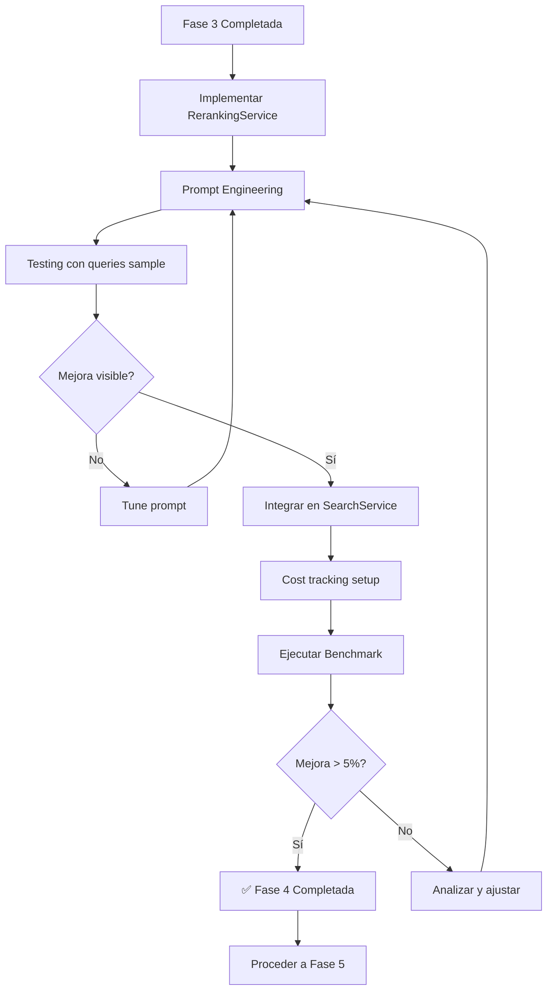

# Fase 4: LLM Reranking - Especificaciones Técnicas

**Fecha:** 22 Noviembre 2025
**Proyecto:** AI-OdooFinder
**Fase:** 4 - LLM Reranking (Two-Stage Retrieval)
**Duración Estimada:** 2-3 días
**Prioridad:** Media-Alta
**Prerequisito:** ✅ Fase 3 completada (Data Enrichment)

---

## 📋 Objetivo

Implementar two-stage retrieval usando Claude Haiku para reordenar inteligentemente los top 50 candidatos del hybrid search, mejorando la precisión especialmente en queries ambiguas o multi-concepto.

---

## 🎯 Problema a Resolver

Del **Failure Analysis de Fases 1-3**, identificamos:

### Patrón 1: Queries Multi-Concepto (20% de fallos residuales)
```
Query: "portal clientes con documentos personalizados"
Hybrid Search top 5:
  1. portal                    ← Muy genérico
  2. website_portal            ← No es lo que busca
  3. customer_portal           ← Relacionado pero no específico
  4. portal_document           ← ✅ Este es el correcto! (pero en #4)
  5. document_management       ← Relacionado

Problema: Hybrid search rankea "portal" alto porque coincide keyword,
         pero no entiende el CONTEXTO completo de la query
```

**Solución: LLM Reranking**
- Claude lee la query completa + contexto de cada módulo
- Entiende la intención (portal + documentos + personalización)
- Reordena: portal_document pasa de #4 a #1

---

## 🏗️ Arquitectura: Two-Stage Retrieval

```
┌─────────────────────────────────────────────────────┐
│              User Query                             │
│   "portal clientes con documentos personalizados"   │
└─────────────────────┬───────────────────────────────┘
                      │
         ┌────────────▼────────────┐
         │  Stage 1: Fast Retrieval│
         │  (Hybrid Search)        │
         │                         │
         │  Vector + BM25 + RRF    │
         │  Returns top 50         │
         └────────────┬────────────┘
                      │
            50 candidates
            (high recall)
                      │
         ┌────────────▼────────────┐
         │  Stage 2: Reranking     │
         │  (Claude Haiku)         │
         │                         │
         │  LLM reads query +      │
         │  context of each module │
         │  Scores 1-100           │
         │  Returns top 10         │
         └────────────┬────────────┘
                      │
                ┌─────▼──────┐
                │  Top 10    │
                │  (precision)│
                └────────────┘
```

**Why Two-Stage?**
1. **Stage 1 (Fast):** Hybrid search es rápido (~200ms), alta recall
2. **Stage 2 (Precise):** LLM es lento pero preciso, alta precisión
3. **Combinado:** Best of both worlds - rápido Y preciso

---

## 📊 Componentes Técnicos

### 1. Reranking Service

**Servicio:** `app/services/reranking_service.py`

**Responsabilidades:**
- Tomar top 50 candidatos del hybrid search
- Construir prompt con query + contexto de módulos
- Llamar a Claude Haiku para scoring
- Reordenar por LLM scores
- Retornar top N final

### 2. Prompt Engineering

**Template:**
```
Eres un experto en Odoo ERP. Evalúa qué tan relevante es cada módulo
para la búsqueda del usuario.

User Query: "{query}"

Módulos candidatos:
[Lista de módulos con contexto]

Para cada módulo, asigna un score de 0-100 basándote en:
- Qué tan bien coincide con la INTENCIÓN de la búsqueda
- Relevancia funcional (no solo keyword matching)
- Utilidad práctica para el caso de uso

Return JSON:
[
  {"technical_name": "...", "score": 95, "reason": "..."},
  ...
]
```

### 3. Cost Optimization

**Claude Haiku pricing:**
- Input: ~$0.25 per million tokens
- Output: ~$1.25 per million tokens

**Cost per search:**
- Query: ~50 tokens
- 50 modules context: ~2,500 tokens
- LLM response: ~200 tokens
- **Total:** ~$0.0008 per search

**Budget planning:**
- 1,000 searches/day → $0.80/day
- 30,000 searches/month → $24/month
- Reasonable for production

---

## 🎯 Entregables

| # | Entregable | Archivo | Criterio de Éxito |
|---|------------|---------|-------------------|
| 1 | Reranking Service | `app/services/reranking_service.py` | Implementado y testeable |
| 2 | Prompt Template | En RerankingService | Optimizado para Odoo |
| 3 | Integration | Modificar SearchService | Flag `enable_reranking` |
| 4 | Cost Tracking | Logging de API calls | Monitoreable |
| 5 | Benchmark Results | `tests/results/reranked_YYYYMMDD.json` | P@3 mejora >5% |

---

## 📚 Especificaciones

1. [SPEC-301: Reranking Service](./SPEC-301-reranking-service.md)
2. [SPEC-302: Prompt Engineering](./SPEC-302-prompt-engineering.md)
3. [SPEC-303: Search Flow Integration](./SPEC-303-search-integration.md)
4. [SPEC-304: Cost Optimization](./SPEC-304-cost-optimization.md)
5. [SPEC-305: Acceptance Criteria](./SPEC-305-acceptance-criteria.md)

---

## 🔄 Flujo de Trabajo



---

## 📊 Métricas de Éxito

### Target Principal
```yaml
Precision@3 Improvement:
  Baseline (Fase 3): ~63%
  Target (Fase 4):   >68%  (+5 puntos porcentuales)
  Stretch Goal:      >70%  (+7 puntos porcentuales)
```

### Métricas Secundarias
```yaml
MRR Improvement: +0.05-0.10
First Result Hit Rate: +10-15%

Cost Control:
  Per search: < $0.001
  Daily budget: < $1.00 (1000 searches)
```

### Latency
```yaml
Total search time (hybrid + reranking):
  P50: < 800ms
  P95: < 1500ms
  P99: < 2500ms
```

---

## 🧪 Tests de Validación

### Test 1: Reranking Improves Order

```python
def test_reranking_improves_ranking():
    """Verifica que reranking mejora el orden."""

    query = "portal clientes con documentos"

    # Stage 1: Hybrid search
    hybrid_results = await hybrid_service.search(query, version="16.0", limit=50)

    # Stage 2: Reranking
    reranked = await reranking_service.rerank(query, hybrid_results, limit=5)

    # Expected: portal_document should rank higher after reranking
    hybrid_position = next(i for i, r in enumerate(hybrid_results) if 'document' in r.technical_name)
    reranked_position = next(i for i, r in enumerate(reranked) if 'document' in r.technical_name)

    assert reranked_position < hybrid_position, "Reranking should improve position"
```

### Test 2: Cost Tracking

```python
def test_cost_tracking():
    """Verifica que se trackean costos."""

    service = RerankingService()

    service.rerank(query, candidates, limit=5)

    # Should log cost metrics
    assert service.total_cost > 0
    assert service.requests_count > 0
```

---

## 🚨 Riesgos y Mitigaciones

### Riesgo 1: Latencia Alta (>2s)
**Impacto:** Alto - UX pobre
**Probabilidad:** Media
**Mitigación:**
- Limitar reranking a top 30 (en vez de 50)
- Cache de reranking para queries populares
- Async processing si es posible
- Feature flag para disable si es necesario

### Riesgo 2: Costo Excesivo
**Impacto:** Medio
**Probabilidad:** Baja
**Mitigación:**
- Daily budget alerts ($5/day threshold)
- Rate limiting por usuario
- Cache agresivo
- Usar Haiku (no Sonnet)

### Riesgo 3: No Mejora Significativa (<3%)
**Impacto:** Medio - ROI cuestionable
**Probabilidad:** Media
**Mitigación:**
- Prompt engineering iterativo
- A/B testing con diferentes prompts
- Focus en queries multi-concepto
- Si no mejora >3%, considerar skip

### Riesgo 4: LLM Responses Inconsistentes
**Impacto:** Medio
**Probabilidad:** Media
**Mitigación:**
- Temperature = 0 para determinismo
- JSON mode para structured output
- Retry logic con fallback

---

## 🔧 Dependencias Técnicas

### Nuevas Dependencias
```bash
# Claude API (ya usado en Fase 3)
# No nuevas dependencias de Python
```

### Servicios Externos
- **Claude API (Haiku):** Para reranking
- **Redis (opcional):** Para caching de reranking results

### Archivos Nuevos
```
app/services/reranking_service.py
app/utils/cost_tracker.py
tests/test_reranking_service.py
```

### Archivos Modificados
```
app/services/search_service.py (añadir reranking step)
app/config.py (añadir flags de reranking)
```

---

## 📝 Notas de Implementación

### Orden Recomendado

1. **Reranking Service** (SPEC-301) - 3 horas
   - Implementar clase base
   - Prompt template inicial
   - API integration

2. **Prompt Engineering** (SPEC-302) - 2 horas
   - Optimizar prompt
   - Testing con queries reales
   - A/B testing de prompts

3. **Integration** (SPEC-303) - 1 hora
   - Añadir a SearchService
   - Feature flag
   - Error handling

4. **Cost Optimization** (SPEC-304) - 1 hora
   - Caching strategy
   - Cost tracking
   - Budget alerts

5. **Benchmark** (SPEC-305) - 1 hora
   - Ejecutar benchmark
   - Analizar mejoras
   - Cost analysis

**Total:** ~8 horas (1 día concentrado)

---

## 💡 Consideraciones de Diseño

### ¿Por qué Claude Haiku y no Sonnet?

**Haiku ventajas:**
- 10x más económico (~$0.0008 vs $0.008 per search)
- Más rápido (~500ms vs ~1500ms)
- Suficiente capacidad para reranking

**Cuándo considerar Sonnet:**
- Si mejora < 3% con Haiku
- Si latencia no es crítica
- Si budget lo permite

### ¿Por qué Top 50 y no Top 100?

**Razón:**
- Top 50 tiene recall ~90% (suficiente)
- Top 100 → 2x cost, 2x latency
- Diminishing returns después de 50

### ¿Por qué No Fine-Tuning?

**Razón:**
- Zero-shot es suficiente para reranking
- Fine-tuning caro (~$1000+)
- Prompt engineering más flexible
- Puede cambiar taxonomy sin retrain

---

## 🎓 Aprendizajes Esperados

Al completar esta fase aprenderás:

1. **Two-stage retrieval patterns** en IR
2. **Prompt engineering** para ranking tasks
3. **Cost-benefit analysis** de LLMs en prod
4. **Latency optimization** con LLM APIs
5. **Caching strategies** para LLM responses

---

## ✅ Checklist de Implementación

- [ ] Crear branch `phase-4-reranking`
- [ ] Implementar SPEC-301 (RerankingService)
- [ ] Implementar SPEC-302 (Prompt optimization)
- [ ] Test con 20 queries sample
- [ ] Implementar SPEC-303 (Integration)
- [ ] Implementar SPEC-304 (Cost tracking)
- [ ] Ejecutar benchmark completo
- [ ] Validar mejora > 5%
- [ ] Cost analysis (< $1/day)
- [ ] Code review
- [ ] Merge con tag `phase-4-complete`

---

## 🔗 Referencias

### Two-Stage Retrieval
- Cohere Rerank API
- Sentence Transformers Cross-Encoder
- ColBERT Late Interaction

### LLM Reranking
- RankGPT (OpenAI)
- LLM4Rerank (Papers with Code)

### Cost Optimization
- LLM Caching Strategies
- Prompt Compression Techniques

---

## 🎯 Decisión Crítica: ¿Implementar Fase 4?

### Implementar SI:
```yaml
✅ Fase 3 P@3 < 70% (hay margen de mejora)
✅ Presupuesto permite $20-50/mes
✅ Latencia < 1s es aceptable
✅ Queries multi-concepto son comunes
```

### Skip SI:
```yaml
❌ Fase 3 P@3 > 75% (ya muy bueno)
❌ Budget muy limitado (< $10/mes)
❌ Latencia debe ser < 500ms (crítico)
❌ Queries muy simples (keyword-based)
```

**Recomendación:** Implementar si Fase 3 está entre 60-70% P@3

---

**Estado:** 🟢 Specs en progreso
**Prerequisito:** Fase 3 completada
**Próximo paso:** Implementar SPEC-301 (Reranking Service)
