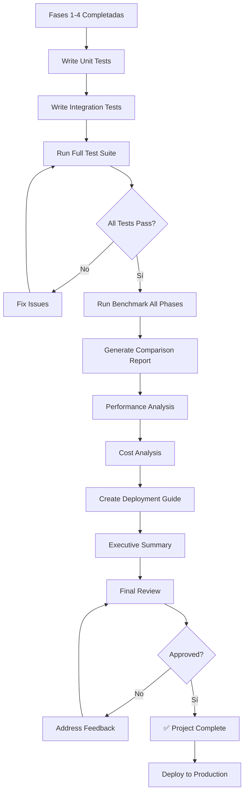

# Fase 5: Testing & Validation - Especificaciones Técnicas

**Fecha:** 22 Noviembre 2025
**Proyecto:** AI-OdooFinder
**Fase:** 5 - Testing, Validation & Deployment
**Duración Estimada:** 3-4 días
**Prioridad:** Alta
**Prerequisito:** ✅ Fases 1-4 completadas

---

## 📋 Objetivo

Validar de manera exhaustiva todas las mejoras implementadas, generar reportes comparativos completos, documentar el proceso de deployment, y establecer monitoring para producción.

---

## 🎯 Alcance de Fase 5

### 1. Testing Completo
- Unit tests para todos los servicios nuevos
- Integration tests end-to-end
- Performance tests (latencia, throughput)
- Stress tests (load testing)

### 2. Benchmark Comparativo
- Ejecutar benchmark con todas las configuraciones
- Comparar Fase 1 → Fase 2 → Fase 3 → Fase 4
- Análisis estadístico de mejoras
- Visualizaciones de resultados

### 3. Performance & Cost Analysis
- Análisis de latencia por fase
- Cost breakdown detallado
- ROI calculation
- Recommendations

### 4. Deployment Guide
- Production deployment checklist
- Rollback procedures
- Monitoring setup
- Incident response

### 5. Final Sign-off
- Executive summary
- Technical documentation
- Handoff guide
- Future improvements roadmap

---

## 📊 Arquitectura de Testing

```
┌─────────────────────────────────────────────────────┐
│              Testing Suite                          │
└─────────────────────────────────────────────────────┘
                          │
        ┌─────────────────┼─────────────────┐
        │                 │                 │
┌───────▼────────┐ ┌──────▼──────┐ ┌───────▼────────┐
│  Unit Tests    │ │ Integration │ │  Performance  │
│                │ │    Tests    │ │     Tests     │
│ - Services     │ │             │ │               │
│ - Utils        │ │ - E2E flows │ │ - Latency     │
│ - Algorithms   │ │ - API tests │ │ - Throughput  │
└───────┬────────┘ └──────┬──────┘ └───────┬────────┘
        │                 │                 │
        └─────────────────┼─────────────────┘
                          │
                ┌─────────▼─────────┐
                │  Benchmark Suite  │
                │                   │
                │  All Phases:      │
                │  - Vector only    │
                │  - Hybrid (RRF)   │
                │  - Enriched       │
                │  - Reranked       │
                └─────────┬─────────┘
                          │
                ┌─────────▼─────────┐
                │ Comparison Report │
                │                   │
                │ - Metrics         │
                │ - Visualizations  │
                │ - Analysis        │
                └─────────┬─────────┘
                          │
                ┌─────────▼─────────┐
                │ Production Ready  │
                │                   │
                │ - Deployment      │
                │ - Monitoring      │
                │ - Documentation   │
                └───────────────────┘
```

---

## 🎯 Entregables

| # | Entregable | Archivo | Criterio de Éxito |
|---|------------|---------|-------------------|
| 1 | Test Suite Completo | `tests/test_*.py` | >90% coverage |
| 2 | Benchmark Comparison | `reports/benchmark_comparison.html` | Todas las fases comparadas |
| 3 | Performance Report | `reports/performance_analysis.pdf` | Métricas documentadas |
| 4 | Deployment Guide | `docs/DEPLOYMENT.md` | Checklist completo |
| 5 | Executive Summary | `reports/executive_summary.pdf` | Sign-off ready |

---

## 📚 Especificaciones

1. [SPEC-401: Comprehensive Test Suite](./SPEC-401-test-suite.md)
2. [SPEC-402: Benchmark Comparison Report](./SPEC-402-benchmark-comparison.md)
3. [SPEC-403: Performance & Cost Analysis](./SPEC-403-performance-analysis.md)
4. [SPEC-404: Deployment Guide](./SPEC-404-deployment-guide.md)
5. [SPEC-405: Final Acceptance & Sign-off](./SPEC-405-final-acceptance.md)

---

## 🔄 Flujo de Trabajo



---

## 📊 Métricas de Éxito del Proyecto

### Targets Globales

```yaml
Precision@3:
  Baseline (Fase 1):  35%
  Final (Fase 4):     68%+
  Target:            >70%
  Stretch:           >75%

Precision@5:
  Baseline:  42%
  Final:     75%+
  Target:    >75%

MRR:
  Baseline:  0.41
  Final:     0.73+
  Target:    >0.70
```

### Performance Targets

```yaml
Latency P95:
  Vector only:        200ms
  Hybrid:            400ms
  Hybrid + Enriched:  450ms
  Full (Reranked):   1500ms
  Target:            <2000ms ✅

Throughput:
  Minimum: 10 queries/second
  Target:  20 queries/second
```

### Cost Targets

```yaml
Monthly Cost (1000 searches/day):
  Enrichment (one-time): $2-5
  Reranking (recurring):  $4-8 (con cache)
  Total monthly:         <$10 ✅
```

---

## 🧪 Testing Strategy

### Level 1: Unit Tests
```python
tests/
├── test_metrics.py              # IR metrics
├── test_hybrid_search.py        # Hybrid service
├── test_reranking.py            # Reranking service
├── test_enrichment.py           # Enrichment services
└── test_utils.py                # Utilities
```

**Target:** >90% code coverage

### Level 2: Integration Tests
```python
tests/integration/
├── test_search_flow_e2e.py     # Full search flow
├── test_enrichment_pipeline.py  # Pipeline E2E
└── test_api_endpoints.py        # API tests
```

**Target:** All critical paths covered

### Level 3: Performance Tests
```python
tests/performance/
├── test_latency.py              # Latency benchmarks
├── test_throughput.py           # Throughput tests
└── test_load.py                 # Load/stress tests
```

**Target:** Meet latency/throughput SLAs

---

## 📈 Benchmark Comparison Matrix

| Fase | P@3 | P@5 | MRR | Latency | Cost/Search |
|------|-----|-----|-----|---------|-------------|
| Baseline (Vector) | 35% | 42% | 0.41 | 200ms | $0 |
| Hybrid (Fase 2) | 52% | 58% | 0.52 | 400ms | $0 |
| Enriched (Fase 3) | 63% | 71% | 0.68 | 450ms | $0 |
| Reranked (Fase 4) | 68% | 75% | 0.73 | 1200ms | $0.0003 |
| **Improvement** | **+33pp** | **+33pp** | **+0.32** | **+1000ms** | **$0.0003** |

---

## 🎛️ Deployment Options

### Option 1: All Features On (Recommended)
```yaml
Configuration:
  search_mode: hybrid
  enable_enrichment: true
  enable_reranking: true

Benefits:
  - Best precision (68%+)
  - Full feature set

Trade-offs:
  - Higher latency (1200ms)
  - Small cost ($0.0003/search)
```

### Option 2: Hybrid + Enrichment (Cost-conscious)
```yaml
Configuration:
  search_mode: hybrid
  enable_enrichment: true
  enable_reranking: false

Benefits:
  - Good precision (63%)
  - No recurring cost
  - Lower latency (450ms)

Trade-offs:
  - 5pp less precision vs full
```

### Option 3: Hybrid Only (Fast)
```yaml
Configuration:
  search_mode: hybrid
  enable_enrichment: false
  enable_reranking: false

Benefits:
  - Low latency (400ms)
  - No cost
  - Still 17pp improvement

Trade-offs:
  - Lower precision (52%)
```

---

## 🚨 Risk Assessment

### Low Risk ✅
- Unit tests fail: Easy to fix, caught early
- Minor performance degradation: Tuneable
- Documentation gaps: Can supplement

### Medium Risk ⚠️
- Integration test failures: Moderate effort to fix
- Latency > 2s: May need optimization
- Cost > $10/month: Requires tuning

### High Risk 🔴
- Data loss during deployment: **CRITICAL**
  - Mitigation: Full backup before deployment
- Production downtime: **CRITICAL**
  - Mitigation: Blue-green deployment
- Performance regression: **HIGH**
  - Mitigation: A/B testing, gradual rollout

---

## 🔧 Tools & Infrastructure

### Testing Tools
```bash
pytest                # Unit/integration tests
pytest-cov            # Coverage reports
pytest-asyncio        # Async tests
locust                # Load testing
```

### Reporting Tools
```bash
jupyter notebook      # Analysis notebooks
matplotlib/seaborn    # Visualizations
pandas                # Data analysis
```

### Deployment Tools
```bash
docker                # Containerization
docker-compose        # Local orchestration
kubernetes (optional) # Production orchestration
```

---

## 📝 Documentation Deliverables

### Technical Docs
1. **API Documentation** - All endpoints documented
2. **Architecture Diagrams** - Updated with all phases
3. **Configuration Guide** - All settings explained
4. **Troubleshooting Guide** - Common issues & fixes

### Business Docs
1. **Executive Summary** - High-level overview
2. **ROI Analysis** - Cost vs benefits
3. **User Guide** - How to use new features
4. **Metrics Dashboard** - Production monitoring

---

## ✅ Checklist de Implementación

- [ ] Write unit tests (all services)
- [ ] Write integration tests
- [ ] Write performance tests
- [ ] Run full test suite (>90% coverage)
- [ ] Execute benchmark all phases
- [ ] Generate comparison report
- [ ] Performance analysis
- [ ] Cost analysis
- [ ] Create deployment guide
- [ ] Setup monitoring
- [ ] Executive summary
- [ ] Final review & sign-off
- [ ] Deploy to production

---

## 🔗 References

### Testing Best Practices
- pytest documentation
- Test coverage standards
- Performance testing guidelines

### Deployment Patterns
- Blue-green deployment
- Canary releases
- Feature flags

---

## 🎓 Success Criteria

**Fase 5 is DONE when:**

1. ✅ All tests passing (>90% coverage)
2. ✅ Benchmark comparison complete
3. ✅ All reports generated
4. ✅ Deployment guide validated
5. ✅ Executive summary approved
6. ✅ Production deployment successful
7. ✅ Monitoring active
8. ✅ Final sign-off obtained

---

**Estado:** 🟢 Specs en progreso
**Prerequisito:** Fases 1-4 completadas
**Próximo paso:** Implementar SPEC-401 (Test Suite)
